PEEP-II Behavioral Ratings
================
Rick Gilmore
2019-02-27 11:07:50

-   [Purpose](#purpose)
-   [Preliminaries](#preliminaries)
-   [Copy data and import](#copy-data-and-import)
-   [Mapping between ratings and image icons](#mapping-between-ratings-and-image-icons)
    -   [Angry ratings](#angry-ratings)
    -   [Happy ratings](#happy-ratings)
    -   [Sad ratings](#sad-ratings)
    -   [Scared ratings](#scared-ratings)
    -   [How feel ratings](#how-feel-ratings)
-   [Angry prosody](#angry-prosody)
    -   [Angry ratings](#angry-ratings-1)
    -   [Happy ratings](#happy-ratings-1)
    -   [Sad ratings](#sad-ratings-1)
    -   [Scared ratings](#scared-ratings-1)
    -   [How feel ratings](#how-feel-ratings-1)
-   [Happy prosody](#happy-prosody)
    -   [Happy ratings](#happy-ratings-2)
    -   [Angry ratings](#angry-ratings-2)
    -   [Sad ratings](#sad-ratings-2)
    -   [Scared ratings](#scared-ratings-2)
    -   [How feel ratings](#how-feel-ratings-2)
-   [Sad prosody](#sad-prosody)
    -   [Sad ratings](#sad-ratings-3)
    -   [Angry ratings](#angry-ratings-3)
    -   [Happy ratings](#happy-ratings-3)
    -   [How feel ratings](#how-feel-ratings-3)
-   [Comparative ratings](#comparative-ratings)
    -   [Single child](#single-child)
-   [Know speaker](#know-speaker)
-   [Time series of ratings](#time-series-of-ratings)
    -   [Family 1](#family-1)
    -   [Family 2](#family-2)
    -   [Family 3](#family-3)
    -   [Family 4](#family-4)
-   [Next steps](#next-steps)
-   [Resources](#resources)

Purpose
-------

This notebook documents the process of exploring the PEEP-II ratings data.

Preliminaries
-------------

Load libraries.

``` r
library(tidyverse)
```

    ## ── Attaching packages ────────── tidyverse 1.2.1 ──

    ## ✔ ggplot2 3.1.0       ✔ purrr   0.3.0  
    ## ✔ tibble  2.0.1       ✔ dplyr   0.8.0.1
    ## ✔ tidyr   0.8.2       ✔ stringr 1.4.0  
    ## ✔ readr   1.3.1       ✔ forcats 0.3.0

    ## ── Conflicts ───────────── tidyverse_conflicts() ──
    ## ✖ dplyr::filter() masks stats::filter()
    ## ✖ dplyr::lag()    masks stats::lag()

``` r
library(stringr)
```

Copy data and import
--------------------

The behavioral data are currently (2017-06-20-15:02) stored in `~/Box\ Sync/b-peep-project\ Shared/PEEP2\ data/PEEP2\ Home\ visit\ behavioural\ data/` as a set of `*.csv` files.

``` r
peep2.data.dir <- "~/Box\ Sync/b-peep-project\ Shared/PEEP2\ data/PEEP2\ Home\ visit\ behavioural\ data/"

# List files and open one for inspection
peep2.flist <- list.files(path = peep2.data.dir, pattern = "\\.csv$", full.names = TRUE)
peep2.test.df <- read.csv(file = peep2.flist[1])
str(peep2.test.df)
```

    ## 'data.frame':    33 obs. of  11 variables:
    ##  $ fam_id      : int  1 1 1 1 1 1 1 1 1 1 ...
    ##  $ nov_id      : int  6 6 6 6 6 6 6 6 6 6 ...
    ##  $ run         : int  1 1 1 1 1 1 1 1 1 1 ...
    ##  $ order       : int  4 4 4 4 4 4 4 4 4 4 ...
    ##  $ sound_index : int  1 2 3 4 5 6 7 8 9 10 ...
    ##  $ snd_file    : Factor w/ 32 levels "wav/001/norm/001-ang-chk-a.wav",..: 27 8 17 32 11 18 5 16 26 1 ...
    ##  $ happy_rating: int  2 4 1 1 1 1 1 1 1 1 ...
    ##  $ angry_rating: int  2 1 4 2 2 4 3 2 2 2 ...
    ##  $ sad_rating  : int  1 1 1 4 3 2 2 2 2 2 ...
    ##  $ how_feel    : int  1 1 1 1 1 2 2 3 1 1 ...
    ##  $ know_speaker: int  1 2 5 3 4 3 4 4 5 4 ...

``` r
# Color palette for plotting dots
# 'neutral', 'happy', 'angry', 'sad', 'scared'
emo_colors <- c("black", "green", "red", "blue", "yellow")
```

It looks like the data files are well-structured and the variable names clear. **Note** that the ratings are on a \[1,4\] scale. I don't recall what the `know_speaker` ratings reflect now, but I will check.

Let's proceed to import the existing data and combine it into one file for visualization.

``` r
peep2.df.list <- lapply(peep2.flist, read.csv)
peep2.df <- Reduce(function(x,y) merge(x,y, all =TRUE), peep2.df.list)
str(peep2.df)
```

    ## 'data.frame':    3358 obs. of  12 variables:
    ##  $ fam_id       : int  1 1 1 1 1 1 1 1 1 1 ...
    ##  $ nov_id       : int  6 6 6 6 6 6 6 6 6 6 ...
    ##  $ run          : int  1 1 1 1 1 1 1 1 1 1 ...
    ##  $ order        : int  4 4 4 4 4 4 4 4 4 4 ...
    ##  $ sound_index  : int  1 2 3 4 5 6 7 8 9 10 ...
    ##  $ snd_file     : Factor w/ 1728 levels "wav/001/norm/001-ang-chk-a.wav",..: 27 8 17 32 11 18 5 16 26 1 ...
    ##  $ happy_rating : int  2 4 1 1 1 1 1 1 1 1 ...
    ##  $ angry_rating : int  2 1 4 2 2 4 3 2 2 2 ...
    ##  $ sad_rating   : int  1 1 1 4 3 2 2 2 2 2 ...
    ##  $ how_feel     : int  1 1 1 1 1 2 2 3 1 1 ...
    ##  $ know_speaker : int  1 2 5 3 4 3 4 4 5 4 ...
    ##  $ scared.rating: int  NA NA NA NA NA NA NA NA NA NA ...

It looks like the `scared.rating` occurs in some of the later data files, but was not present in the first one we examined. Note that that we do not have a variable that specifies the target prosody {'ang', 'hap', 'neu', 'sad'}, the script type {'chk', ...}, or the script variation {'a', 'b'}, but that these are available from the `snd_file` name. It should be relatively easy to pull those from the `snd_file` names. Let's see.

``` r
# Pick character ranges by hand
peep2.df$target_prosody <- str_sub(peep2.df$snd_file, 18, 20)
peep2.df$script_name <- str_sub(peep2.df$snd_file, 22, 24)
peep2.df$script_variation <- str_sub(peep2.df$snd_file, 26, 26)
```

We also need to identify whether the speaker is familiar or novel.

``` r
this_spkr <- as.numeric(str_sub(peep2.df$snd_file, 14, 16))
peep2.df$speaker_fam <- (this_spkr == peep2.df$fam_id)
peep2.df$speaker_famnov <- 'nov'
peep2.df$speaker_famnov[peep2.df$speaker_fam] <- 'fam'
```

Mapping between ratings and image icons
---------------------------------------

### Angry ratings

|                    1                   |                    2                    |                    3                    |                    4                    |     |
|:--------------------------------------:|:---------------------------------------:|:---------------------------------------:|:---------------------------------------:|:---:|
|  |  |  |  |     |

### Happy ratings

|                    1                   |                    2                    |                    3                    |                    4                    |     |
|:--------------------------------------:|:---------------------------------------:|:---------------------------------------:|:---------------------------------------:|:---:|
|  |  |  |  |     |

### Sad ratings

|                    1                   |                    2                    |                    3                    |                    4                    |     |
|:--------------------------------------:|:---------------------------------------:|:---------------------------------------:|:---------------------------------------:|:---:|
|  |  |  |  |     |

### Scared ratings

|                    1                   |                    2                    |                    3                    |                    4                    |     |
|:--------------------------------------:|:---------------------------------------:|:---------------------------------------:|:---------------------------------------:|:---:|
|  |  |  |  |

### How feel ratings

|                 Neutral                |                  Happy                  |                  Angry                  |                   Sad                   |                  Scared                 |
|:--------------------------------------:|:---------------------------------------:|:---------------------------------------:|:---------------------------------------:|:---------------------------------------:|
|  |  |  |  |  |
|                    1                   |                    2                    |                    3                    |                    4                    |                    5                    |

Angry prosody
-------------

### Angry ratings

``` r
peep2.df %>%
  filter(target_prosody %in% "ang") %>%
  ggplot() +
  # aes(x = script_name, y = angry_rating) + 
  # geom_violin() +
  # facet_grid(. ~ script_variation) +
  aes(x = angry_rating) +
  geom_histogram() +
  facet_grid(script_name ~ script_variation) +
  ggtitle("Angry prosody: Anger ratings")
```

    ## `stat_bin()` using `bins = 30`. Pick better value with `binwidth`.


There is no obvious effect of the `script_name` or `script_variation`. Let's look at familiarity.

``` r
peep2.df %>%
  filter(target_prosody %in% "ang") %>%
  ggplot() +
  # aes(x = script_name, y = angry_rating) + 
  # geom_violin() +
  # facet_grid(. ~ script_variation) +
  aes(x = angry_rating) +
  geom_histogram() +
  facet_grid(. ~ speaker_famnov) +
  ggtitle("Angry prosody: Anger ratings by speaker familiarity")
```

    ## `stat_bin()` using `bins = 30`. Pick better value with `binwidth`.


``` r
peep2.df %>%
  filter(target_prosody %in% "ang") %>%
  ggplot() +
  aes(x = speaker_famnov, y = angry_rating) +
  geom_boxplot() +
  geom_jitter(width = 0.25, height = 0.1, alpha = 0.3) +
  facet_grid(script_name ~ script_variation) +
  ggtitle("Angry prosody: Anger ratings by speaker familiarity")
```


### Happy ratings

``` r
peep2.df %>%
  filter(target_prosody %in% "ang") %>%
  ggplot() +
  # aes(x = script_name, y = happy_rating) + 
  # geom_violin() +
  # facet_grid(. ~ script_variation) +
  aes(x = happy_rating) +
  geom_histogram() +
  facet_grid(script_name ~ script_variation) +
  ggtitle("Angry prosody: Happy ratings")
```

    ## `stat_bin()` using `bins = 30`. Pick better value with `binwidth`.


Again, let's look at this by familiarity.

``` r
peep2.df %>%
  filter(target_prosody %in% "ang") %>%
  ggplot() +
  # aes(x = script_name, y = happy_rating) + 
  # geom_violin() +
  # facet_grid(. ~ script_variation) +
  aes(x = happy_rating) +
  geom_histogram() +
  facet_grid(. ~ speaker_famnov) +
  ggtitle("Angry prosody: Happy ratings by speaker familiarity")
```

    ## `stat_bin()` using `bins = 30`. Pick better value with `binwidth`.


``` r
peep2.df %>%
  filter(target_prosody %in% "ang") %>%
  ggplot() +
  aes(x = speaker_famnov, y = happy_rating) +
  geom_boxplot() +
  facet_grid(script_name ~ script_variation) +
  ggtitle("Angry prosody: Happy ratings by speaker familiarity")
```


### Sad ratings

``` r
peep2.df %>%
  filter(target_prosody %in% "ang") %>%
  ggplot() +
  # aes(x = script_name, y = sad_rating) + 
  # geom_violin() +
  # facet_grid(. ~ script_variation) +
  aes(x = sad_rating) +
  geom_histogram() +
  facet_grid(script_name ~ script_variation) +
  ggtitle("Angry prosody: Sad ratings")
```

    ## `stat_bin()` using `bins = 30`. Pick better value with `binwidth`.

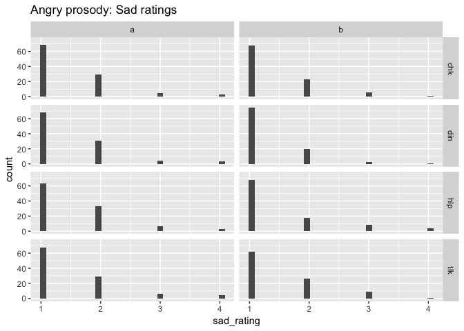

By speaker familiarity...

``` r
peep2.df %>%
  filter(target_prosody %in% "ang") %>%
  ggplot() +
  # aes(x = script_name, y = sad_rating) + 
  # geom_violin() +
  # facet_grid(. ~ script_variation) +
  aes(x = sad_rating) +
  geom_histogram() +
  facet_grid(. ~ speaker_famnov) +
  ggtitle("Angry prosody: Sad ratings by speaker familiarity")
```

    ## `stat_bin()` using `bins = 30`. Pick better value with `binwidth`.


### Scared ratings

``` r
peep2.df %>%
  filter(target_prosody %in% "ang") %>%
  ggplot() +
  # aes(x = script_name, y = scared.rating) + 
  # geom_violin() +
  # facet_grid(. ~ script_variation) +
  aes(x = scared.rating) +
  geom_histogram() +
  facet_grid(script_name ~ script_variation) +
  ggtitle("Angry prosody: Scared ratings")
```

    ## `stat_bin()` using `bins = 30`. Pick better value with `binwidth`.

    ## Warning: Removed 64 rows containing non-finite values (stat_bin).


### How feel ratings

The `how_feel` variable codes on a \[1,5\] scale the participant's response to the question: 'How did this make you feel?'

The mapping from facial expression to image exemplar was as follows: 1 = neutral, 2 = mid-happy, 3 = mid-angry, 4= mid-sad, 5 = mid-scared.

Let's add these labels to the `how_feel` so it's easier to see the pattern.

``` r
f <- factor(peep2.df$how_feel)
levels(f) <- c(NA, 'neu', 'hap', 'ang', 'sad', 'sca')
peep2.df$how_feel <- f
```

``` r
peep2.df %>%
  filter(target_prosody %in% "ang") %>%
  ggplot() +
  # aes(x = script_name, y = how_feel) + 
  # geom_violin() +
  # facet_grid(. ~ script_variation) +
  aes(x = how_feel) +
  geom_bar() +
  facet_grid(script_name ~ script_variation) +
  ggtitle("Angry prosody: How does it make you feel?")
```


``` r
peep2.df %>%
  filter(target_prosody %in% "ang") %>%
  ggplot() +
  # aes(x = script_name, y = how_feel) + 
  # geom_violin() +
  # facet_grid(. ~ script_variation) +
  aes(x = how_feel) +
  geom_bar() +
  facet_grid(. ~ speaker_famnov) +
  ggtitle("Angry prosody: How does it make you feel?")
```


``` r
peep2.df %>%
  filter(target_prosody %in% "ang",
         how_feel %in% c('neu', 'hap', 'ang', 'sad', 'sca')) %>%
  ggplot() +
  aes(x = how_feel, y = angry_rating, color = how_feel) +
  geom_jitter(width = 0.25, height = 0.20, alpha=0.3) +
  facet_grid(. ~ speaker_famnov) +
  ggtitle("Angry prosody: How does it make you feel?") +
  scale_colour_manual(values = emo_colors)
```

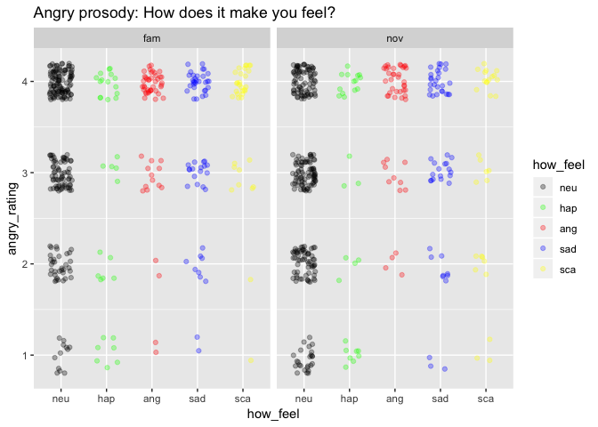

Participants feel largely neutral about the angry voices, with a bit of anger and sadness.

``` r
peep2.df %>%
  filter(target_prosody %in% "ang") %>%
  ggplot() +
  aes(x = how_feel, y = angry_rating) +
  geom_violin() +
  facet_grid(. ~ speaker_famnov) +
  ggtitle("Angry prosody: How does it make you feel?")
```


Remember...

|                 Neutral                |                  Happy                  |                  Angry                  |                   Sad                   |                  Scared                 |
|:--------------------------------------:|:---------------------------------------:|:---------------------------------------:|:---------------------------------------:|:---------------------------------------:|
|  |  |  |  |  |
|                    1                   |                    2                    |                    3                    |                    4                    |                    5                    |

Happy prosody
-------------

### Happy ratings

``` r
peep2.df %>%
  filter(target_prosody %in% "hap") %>%
  ggplot() +
  # aes(x = script_name, y = happy_rating) + 
  # geom_violin() +
  # facet_grid(. ~ script_variation) +
  aes(x = happy_rating) +
  geom_histogram() +
  facet_grid(script_name ~ script_variation) +
  ggtitle("Happy prosody: Happy ratings")
```

    ## `stat_bin()` using `bins = 30`. Pick better value with `binwidth`.

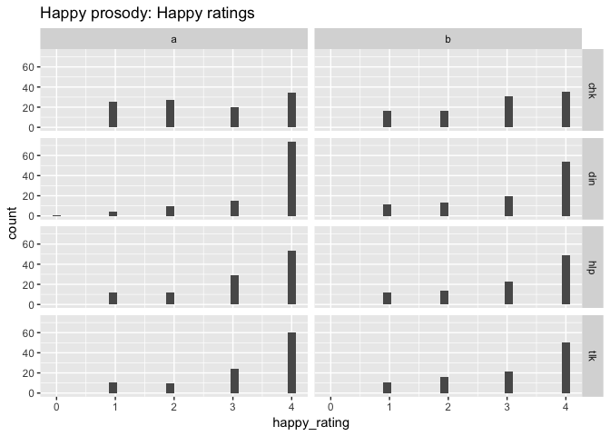

By speaker...

``` r
peep2.df %>%
  filter(target_prosody %in% "hap") %>%
  ggplot() +
  # aes(x = script_name, y = happy_rating) + 
  # geom_violin() +
  # facet_grid(. ~ script_variation) +
  aes(x = happy_rating) +
  geom_histogram() +
  facet_grid(. ~ speaker_famnov) +
  ggtitle("Happy prosody: Happy ratings by speaker familiarity")
```

    ## `stat_bin()` using `bins = 30`. Pick better value with `binwidth`.


``` r
peep2.df %>%
  filter(target_prosody %in% "hap") %>%
  ggplot() +
  aes(x = speaker_famnov, y = happy_rating) +
  geom_boxplot() +
  facet_grid(script_name ~ script_variation) +
  ggtitle("Happy prosody: Happy ratings by speaker familiarity")
```


### Angry ratings

``` r
peep2.df %>%
  filter(target_prosody %in% "hap") %>%
  ggplot() +
  # aes(x = script_name, y = angry_rating) + 
  # geom_violin() +
  # facet_grid(. ~ script_variation) +
  aes(x = angry_rating) +
  geom_histogram() +
  facet_grid(script_name ~ script_variation) +
  ggtitle("Happy prosody: Angry ratings")
```

    ## `stat_bin()` using `bins = 30`. Pick better value with `binwidth`.


``` r
peep2.df %>%
  filter(target_prosody %in% "hap") %>%
  ggplot() +
  # aes(x = script_name, y = angry_rating) + 
  # geom_violin() +
  # facet_grid(. ~ script_variation) +
  aes(x = angry_rating) +
  geom_histogram() +
  facet_grid(. ~ speaker_famnov) +
  ggtitle("Happy prosody: Angry ratings by speaker familiarity")
```

    ## `stat_bin()` using `bins = 30`. Pick better value with `binwidth`.


### Sad ratings

``` r
peep2.df %>%
  filter(target_prosody %in% "hap") %>%
  ggplot() +
  # aes(x = script_name, y = sad_rating) + 
  # geom_violin() +
  # facet_grid(. ~ script_variation) +
  aes(x = sad_rating) +
  geom_histogram() +
  facet_grid(script_name ~ script_variation) +
  ggtitle("Happy prosody: Sad ratings")
```

    ## `stat_bin()` using `bins = 30`. Pick better value with `binwidth`.

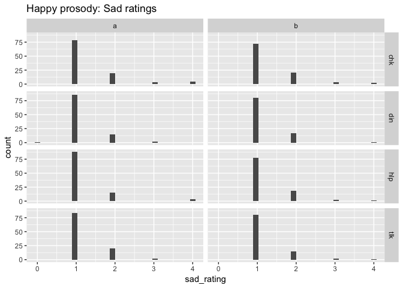

``` r
peep2.df %>%
  filter(target_prosody %in% "hap") %>%
  ggplot() +
  # aes(x = script_name, y = sad_rating) + 
  # geom_violin() +
  # facet_grid(. ~ script_variation) +
  aes(x = sad_rating) +
  geom_histogram() +
  facet_grid(. ~ speaker_famnov) +
  ggtitle("Happy prosody: Sad ratings by speaker familiarity")
```

    ## `stat_bin()` using `bins = 30`. Pick better value with `binwidth`.


### Scared ratings

``` r
peep2.df %>%
  filter(target_prosody %in% "hap") %>%
  ggplot() +
  # aes(x = script_name, y = scared.rating) + 
  # geom_violin() +
  # facet_grid(. ~ script_variation) +
  aes(x = scared.rating) +
  geom_histogram() +
  facet_grid(script_name ~ script_variation) +
  ggtitle("Happy prosody: Scared ratings")
```

    ## `stat_bin()` using `bins = 30`. Pick better value with `binwidth`.

    ## Warning: Removed 64 rows containing non-finite values (stat_bin).


### How feel ratings

``` r
peep2.df %>%
  filter(target_prosody %in% "hap") %>%
  ggplot() +
  # aes(x = script_name, y = how_feel) + 
  # geom_violin() +
  # facet_grid(. ~ script_variation) +
  aes(x = how_feel) +
  geom_bar() +
  facet_grid(script_name ~ script_variation) +
  ggtitle("Happy prosody: How does it make you feel?")
```

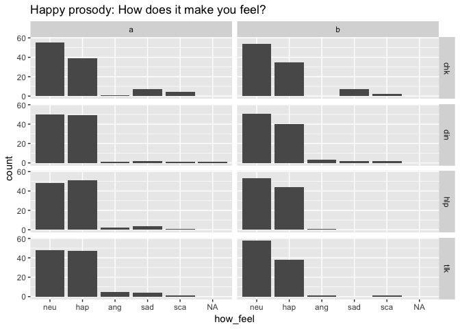

``` r
peep2.df %>%
  filter(target_prosody %in% "hap") %>%
  ggplot() +
  aes(x = how_feel) +
  geom_bar() +
  facet_grid(. ~ speaker_famnov) +
  ggtitle("Happy prosody: How does it make you feel?")
```


``` r
peep2.df %>%
  filter(target_prosody %in% "hap",
         how_feel %in% c('neu', 'hap', 'ang', 'sad', 'sca')) %>%
  ggplot() +
  aes(x = how_feel, y = happy_rating, color = how_feel) +
  geom_jitter(width = 0.25, height = 0.25, alpha=0.3) +
  facet_grid(. ~ speaker_famnov) +
  ggtitle("Happy prosody: How does it make you feel?") +
  scale_colour_manual(values = emo_colors)
```

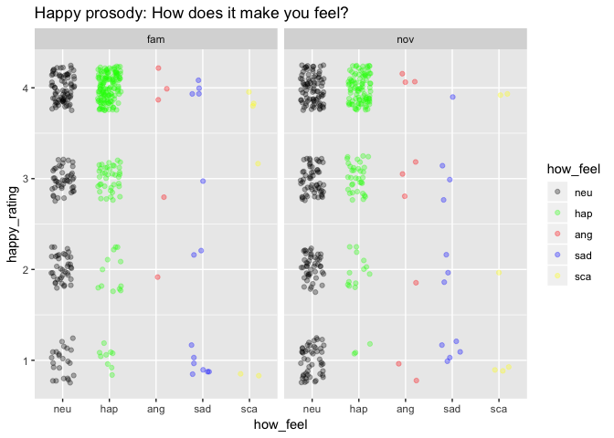

Participants feel largely happy or neutral about the happy prosodies, with more neutral feelings about the unfamiliar speaker.

Sad prosody
-----------

### Sad ratings

``` r
peep2.df %>%
  filter(target_prosody %in% "sad") %>%
  ggplot() +
  # aes(x = script_name, y = sad_rating) + 
  # geom_violin() +
  # facet_grid(. ~ script_variation) +
  aes(x = sad_rating) +
  geom_histogram() +
  facet_grid(script_name ~ script_variation) +
  ggtitle("Sad prosody: Sad ratings")
```

    ## `stat_bin()` using `bins = 30`. Pick better value with `binwidth`.


By speaker...

``` r
peep2.df %>%
  filter(target_prosody %in% "sad") %>%
  ggplot() +
  # aes(x = script_name, y = sad_rating) + 
  # geom_violin() +
  # facet_grid(. ~ script_variation) +
  aes(x = sad_rating) +
  geom_histogram() +
  facet_grid(. ~ speaker_famnov) +
  ggtitle("Sad prosody: Sad ratings by speaker familiarity")
```

    ## `stat_bin()` using `bins = 30`. Pick better value with `binwidth`.


### Angry ratings

``` r
peep2.df %>%
  filter(target_prosody %in% "sad") %>%
  ggplot() +
  # aes(x = script_name, y = angry_rating) + 
  # geom_violin() +
  # facet_grid(. ~ script_variation) +
  aes(x = angry_rating) +
  geom_histogram() +
  facet_grid(script_name ~ script_variation) +
  ggtitle("Sad prosody: Angry ratings")
```

    ## `stat_bin()` using `bins = 30`. Pick better value with `binwidth`.


``` r
peep2.df %>%
  filter(target_prosody %in% "sad") %>%
  ggplot() +
  # aes(x = script_name, y = angry_rating) + 
  # geom_violin() +
  # facet_grid(. ~ script_variation) +
  aes(x = angry_rating) +
  geom_histogram() +
  facet_grid(. ~ speaker_famnov) +
  ggtitle("Sad prosody: Angry ratings by speaker familiarity")
```

    ## `stat_bin()` using `bins = 30`. Pick better value with `binwidth`.


### Happy ratings

``` r
peep2.df %>%
  filter(target_prosody %in% "sad") %>%
  ggplot() +
  # aes(x = script_name, y = happy_rating) + 
  # geom_violin() +
  # facet_grid(. ~ script_variation) +
  aes(x = happy_rating) +
  geom_histogram() +
  facet_grid(script_name ~ script_variation) +
  ggtitle("Sad prosody: Happy ratings")
```

    ## `stat_bin()` using `bins = 30`. Pick better value with `binwidth`.


``` r
peep2.df %>%
  filter(target_prosody %in% "sad") %>%
  ggplot() +
  # aes(x = script_name, y = happy_rating) + 
  # geom_violin() +
  # facet_grid(. ~ script_variation) +
  aes(x = happy_rating) +
  geom_histogram() +
  facet_grid(. ~ speaker_famnov) +
  ggtitle("Sad prosody: Happy ratings by speaker familiarity")
```

    ## `stat_bin()` using `bins = 30`. Pick better value with `binwidth`.


### How feel ratings

``` r
peep2.df %>%
  filter(target_prosody %in% "sad") %>%
  ggplot() +
  # aes(x = script_name, y = how_feel) + 
  # geom_violin() +
  # facet_grid(. ~ script_variation) +
  aes(x = how_feel) +
  geom_bar() +
  facet_grid(script_name ~ script_variation) +
  ggtitle("Sad prosody: How does it make you feel?")
```


``` r
peep2.df %>%
  filter(target_prosody %in% "sad") %>%
  ggplot() +
  # aes(x = script_name, y = how_feel) + 
  # geom_violin() +
  # facet_grid(. ~ script_variation) +
  aes(x = how_feel) +
  geom_bar() +
  facet_grid(. ~ speaker_famnov) +
  ggtitle("Sad prosody: How does it make you feel?")
```


``` r
peep2.df %>%
  filter(target_prosody %in% "sad",
         how_feel %in% c('neu', 'hap', 'ang', 'sad', 'sca')) %>%
  ggplot() +
  aes(x = how_feel, y = sad_rating, color = how_feel) +
  geom_jitter(width = 0.25, height = 0.25, alpha=0.3) +
  facet_grid(. ~ speaker_famnov) +
  ggtitle("Sad prosody: How does it make you feel?") +
  scale_colour_manual(values = emo_colors)
```

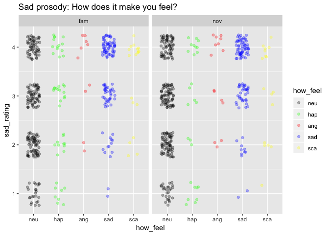

Participants feel neutral or sad in response to the sad prosodies, again slightly more neutral about the unfamiliar speaker.

Comparative ratings
-------------------

``` r
# Note that the `gather` command wants the variables in
# alphabetical order. I don't know why
peep2.gathered.df <- gather(peep2.df, `angry_rating`, `happy_rating`, `sad_rating`, `scared.rating`, key = "rating_type", value = "intensity")

# peep2.gathered.df$rating_type <- as.factor(peep2.gathered.df$rating_type)
# 
# levels(peep2.gathered.df$rating_type) <- c("ang", "hap", "sad", "sca")

peep2.gathered.df %>%
  ggplot() +
  aes(x=intensity) +
  facet_grid(rating_type ~ target_prosody) +
  geom_histogram()
```

    ## `stat_bin()` using `bins = 30`. Pick better value with `binwidth`.

    ## Warning: Removed 264 rows containing non-finite values (stat_bin).

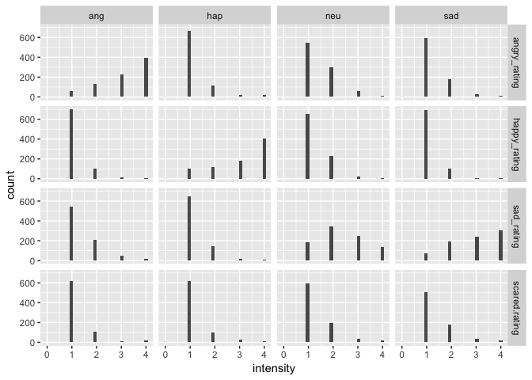

Remove the neutral and scared ratings.

``` r
peep2.gathered.df %>%
  filter(target_prosody != 'neu') %>%
  filter(rating_type != 'scared.rating') %>%
  filter(intensity != 0) %>%
  ggplot() +
  aes(x=intensity, fill = speaker_famnov ) +
  facet_grid(rating_type ~ target_prosody) +
  geom_bar(position="dodge") +
  ggtitle("Intensity ratings by target emotion and speaker familiarity")
```


This suggests that the angry scripts were perceived as angry, but not happy, sad, or scary. Familiar speakers were judged as having greater anger intensity, and lower happy and sad intensities.

The happy scripts were perceived as happy, but not angry, sad, or scary. Familiar speakers were judged as more intensely happy than unfamiliar speakers and less intensely happy or sad.

The sad scripts were perceived as sad, but not angry, happy, or scary. Curiously, the unfamiliar speakers were perceived as slightly sadder than the familiar speaker, and less angry or happy.

Put the scared ratings back in.

``` r
peep2.gathered.df %>%
  filter(target_prosody != 'neu') %>%
  # filter(rating_type != 'scared.rating') %>%
  filter(intensity != 0) %>%
  ggplot() +
  aes(x=intensity, fill = speaker_famnov ) +
  facet_grid(rating_type ~ target_prosody) +
  geom_bar(position="dodge") +
  ggtitle("Intensity ratings by target emotion and speaker familiarity")
```


Angry and happy prosodies do not seem to make children perceive the emotions as scary, but there is a hint that sad prosodies are rated as slightly more intensely scary.

Could also try this with jitter.

``` r
peep2.gathered.df %>%
  filter(target_prosody != 'neu') %>%
  filter(rating_type != 'scared.rating') %>%
  filter(intensity != 0) %>%
  ggplot() +
  aes(x=intensity, y=speaker_famnov, shape = speaker_famnov, color = target_prosody) +
  facet_grid(rating_type ~ target_prosody) +
  geom_jitter(alpha=0.2, height=0.25, width=0.25) +
  ggtitle("Intensity ratings by target emotion and speaker familiarity")
```


### Single child

Let's try one more focusing on a single child.

``` r
peep2.gathered.df %>%
  filter(fam_id == 2) %>%
  # filter(target_prosody != 'neu') %>%
  # filter(rating_type != 'scared.rating') %>%
  filter(intensity != 0) %>%
  ggplot() +
  aes(x=intensity, y=rating_type) +
  facet_grid(target_prosody ~ speaker_famnov) +
  #geom_point(position=position_dodge(width=0.2)) +
  geom_boxplot() +
  # geom_bar(position="dodge") +
  ggtitle("Intensity ratings by target emotion and speaker familiarity")
```


``` r
peep2.gathered.df %>%
  filter(fam_id == 2) %>%
  # filter(target_prosody != 'neu') %>%
  filter(rating_type == 'angry_rating') %>%
  filter(intensity != 0) %>%
  ggplot() +
  aes(x=script_name, y=intensity, color=speaker_famnov, shape=speaker_famnov) +
  facet_grid(target_prosody ~ script_variation) +
  geom_point(position=position_dodge(width=0.15)) +
  ggtitle("Anger intensity ratings")
```


``` r
peep2.gathered.df %>%
  filter(fam_id == 2) %>%
  # filter(target_prosody != 'neu') %>%
  filter(rating_type == 'happy_rating') %>%
  filter(intensity != 0) %>%
  ggplot() +
  aes(x=script_name, y=intensity, color=speaker_famnov, shape=speaker_famnov) +
  facet_grid(target_prosody ~ script_variation) +
  geom_point(position=position_dodge(width=0.15)) +
  ggtitle("Happy intensity ratings")
```

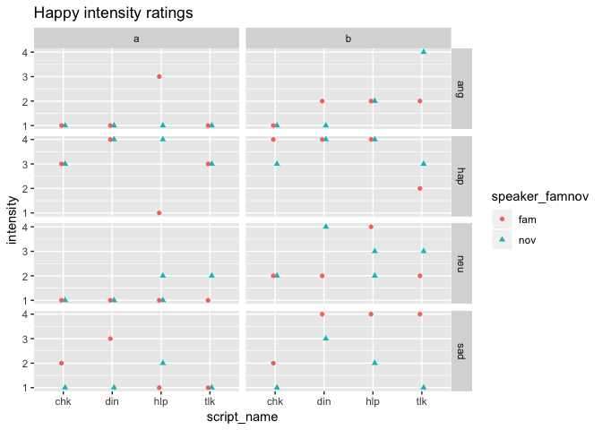

``` r
peep2.gathered.df %>%
  filter(fam_id == 2) %>%
  # filter(target_prosody != 'neu') %>%
  filter(rating_type == 'sad_rating') %>%
  filter(intensity != 0) %>%
  ggplot() +
  aes(x=script_name, y=intensity, color=speaker_famnov, shape=speaker_famnov) +
  facet_grid(target_prosody ~ script_variation) +
  geom_point(position=position_dodge(width=0.15)) +
  ggtitle("Sad intensity ratings")
```


``` r
peep2.gathered.df %>%
  filter(fam_id == 2) %>%
  # filter(target_prosody != 'neu') %>%
  filter(rating_type == 'scared.rating') %>%
  filter(intensity != 0) %>%
  ggplot() +
  aes(x=script_name, y=intensity, color=speaker_famnov, shape=speaker_famnov) +
  facet_grid(target_prosody ~ script_variation) +
  geom_point(position=position_dodge(width=0.15)) +
  ggtitle("Scared intensity ratings")
```


``` r
peep2.gathered.df %>%
  filter(fam_id == 2) %>%
  #filter(rating_type == 'scared.rating') %>%
  filter(intensity != 0) %>%
  ggplot() +
  aes(x=speaker_famnov, y=intensity, fill=speaker_famnov, color=speaker_famnov) +
  facet_grid(rating_type ~ target_prosody) +
  #geom_violin() +
  #geom_point() +
  geom_dotplot(binaxis = "y", stackdir = "center") +
  #geom_jitter(width = 0.1, height = 0, alpha=0.5) +
  ggtitle("Intensity ratings")
```

    ## `stat_bindot()` using `bins = 30`. Pick better value with `binwidth`.


``` r
peep2.gathered.df %>%
  filter(fam_id == 2) %>%
  filter(target_prosody != 'neu') %>%
  filter(rating_type != 'scared.rating') %>%
  filter(intensity != 0) %>%
  ggplot() +
  aes(x=intensity, y=speaker_famnov, shape = speaker_famnov, color = target_prosody) +
  facet_grid(rating_type ~ target_prosody) +
  geom_jitter(height=0.1, width=.1) +
  ggtitle("Intensity ratings by target emotion and speaker familiarity")
```

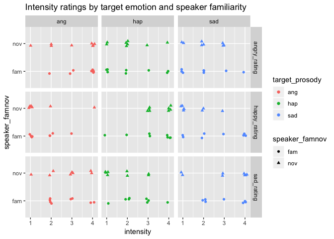

Know speaker
------------

``` r
peep2.gathered.df %>%
  filter(fam_id == 2) %>%
  #filter(rating_type == 'scared.rating') %>%
  filter(intensity != 0) %>%
  ggplot() +
  aes(x=speaker_famnov, y=know_speaker, fill=speaker_famnov, color=speaker_famnov) +
  facet_grid(rating_type ~ target_prosody) +
  #geom_violin() +
  #geom_point() +
  geom_dotplot(binaxis = "y", stackdir = "center") +
  #geom_jitter(width = 0.1, height = 0, alpha=0.5) +
  ggtitle("Know speaker ratings")
```

    ## `stat_bindot()` using `bins = 30`. Pick better value with `binwidth`.

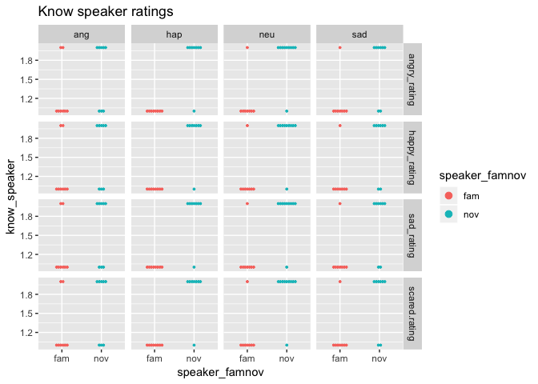

It looks like the `know_speaker` variable is in \[0,5\], but I will need more information to properly plot and interpret these data.

Time series of ratings
----------------------

During the scanning session, participants heard the scripts in a fixed temporal order. It would be useful to visualize the time series of the internal state they might have experienced assuming that state is equal to the post hoc ratings. So, let's imagine a data table that looks something like this:

sound\_index,intensity,rating\_type

Then we plot as separate time series the trial x \*\_rating values, perhaps like this:

### Family 1

    ## Warning: Removed 66 rows containing missing values (geom_path).

    ## Warning: Removed 66 rows containing missing values (geom_point).

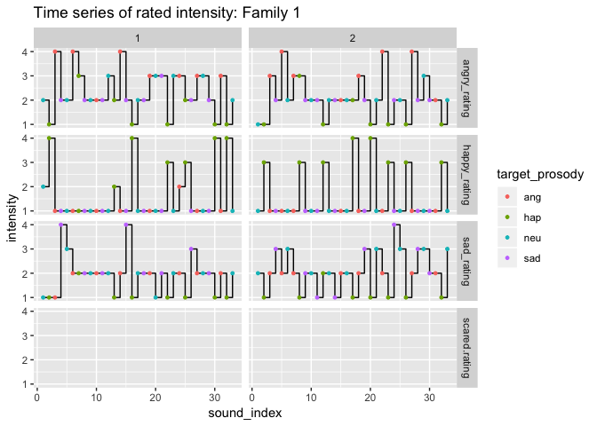

### Family 2


### Family 3

    ## Warning: Removed 66 rows containing missing values (geom_path).

    ## Warning: Removed 66 rows containing missing values (geom_point).

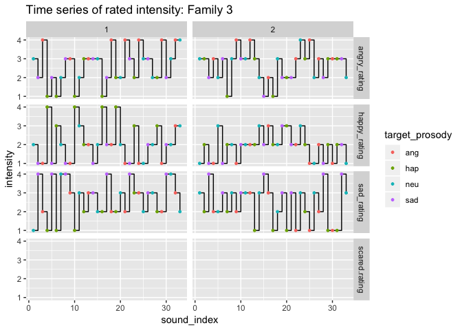

### Family 4


Next steps
----------

1.  ~~Combine ratings so that it is easier to compare how happy, angry, sad, scared each script was rated. Gather the ratings into a single variable in a new data frame. See <https://www.rstudio.com/resources/cheatsheets/>.~~

-   ~~This is partially done as of 2017-06-27.~~

1.  Visualize the time series of ratings.

-   This is partially done as of 2017-07-11.

1.  Conduct cluster analyses on ratings to confirm classification.
2.  Merge with participant metadata.
3.  Add analysis of `know_speaker` variable.

And here are some stylistic/low priority activities:

1.  Write a function to generate plots parametrically.
2.  Explore other `bookdown` features like figure captions.

Resources
---------

This analysis was conducted in RStudio version 1.1.453 on 2019-02-27 11:09:08. Additional information about the working environment is as follows:

``` r
sessionInfo()
```

    ## R version 3.5.2 (2018-12-20)
    ## Platform: x86_64-apple-darwin15.6.0 (64-bit)
    ## Running under: macOS Mojave 10.14.3
    ## 
    ## Matrix products: default
    ## BLAS: /Library/Frameworks/R.framework/Versions/3.5/Resources/lib/libRblas.0.dylib
    ## LAPACK: /Library/Frameworks/R.framework/Versions/3.5/Resources/lib/libRlapack.dylib
    ## 
    ## locale:
    ## [1] en_US.UTF-8/en_US.UTF-8/en_US.UTF-8/C/en_US.UTF-8/en_US.UTF-8
    ## 
    ## attached base packages:
    ## [1] stats     graphics  grDevices utils     datasets  methods   base     
    ## 
    ## other attached packages:
    ## [1] forcats_0.3.0   stringr_1.4.0   dplyr_0.8.0.1   purrr_0.3.0    
    ## [5] readr_1.3.1     tidyr_0.8.2     tibble_2.0.1    ggplot2_3.1.0  
    ## [9] tidyverse_1.2.1
    ## 
    ## loaded via a namespace (and not attached):
    ##  [1] Rcpp_1.0.0       cellranger_1.1.0 pillar_1.3.1     compiler_3.5.2  
    ##  [5] plyr_1.8.4       tools_3.5.2      digest_0.6.18    lubridate_1.7.4 
    ##  [9] jsonlite_1.6     evaluate_0.13    nlme_3.1-137     gtable_0.2.0    
    ## [13] lattice_0.20-38  pkgconfig_2.0.2  rlang_0.3.1      cli_1.0.1       
    ## [17] rstudioapi_0.9.0 yaml_2.2.0       haven_2.0.0      xfun_0.4        
    ## [21] withr_2.1.2      xml2_1.2.0       httr_1.4.0       knitr_1.21      
    ## [25] hms_0.4.2        generics_0.0.2   grid_3.5.2       tidyselect_0.2.5
    ## [29] glue_1.3.0       R6_2.4.0         readxl_1.2.0     rmarkdown_1.11  
    ## [33] reshape2_1.4.3   modelr_0.1.2     magrittr_1.5     backports_1.1.3 
    ## [37] scales_1.0.0     htmltools_0.3.6  rvest_0.3.2      assertthat_0.2.0
    ## [41] colorspace_1.4-0 labeling_0.3     stringi_1.3.1    lazyeval_0.2.1  
    ## [45] munsell_0.5.0    broom_0.5.1      crayon_1.3.4
