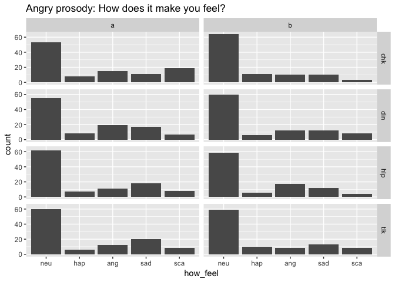
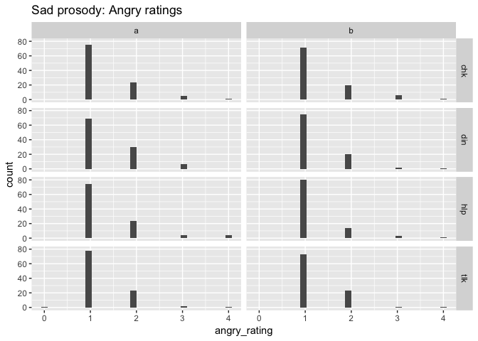

PEEP-II Behavioral Ratings
================
Rick Gilmore
2017-07-11 08:27:46

-   [Purpose](#purpose)
-   [Preliminaries](#preliminaries)
-   [Copy data and import](#copy-data-and-import)
-   [Mapping between ratings and image icons](#mapping-between-ratings-and-image-icons)
    -   [Angry ratings](#angry-ratings)
    -   [Happy ratings](#happy-ratings)
    -   [Sad ratings](#sad-ratings)
    -   [Scared ratings](#scared-ratings)
    -   [How feel ratings](#how-feel-ratings)
-   [Angry prosody](#angry-prosody)
    -   [Angry ratings](#angry-ratings-1)
    -   [Happy ratings](#happy-ratings-1)
    -   [Sad ratings](#sad-ratings-1)
    -   [Scared ratings](#scared-ratings-1)
    -   [How feel ratings](#how-feel-ratings-1)
-   [Happy prosody](#happy-prosody)
    -   [Happy ratings](#happy-ratings-2)
    -   [Angry ratings](#angry-ratings-2)
    -   [Sad ratings](#sad-ratings-2)
    -   [Scared ratings](#scared-ratings-2)
    -   [How feel ratings](#how-feel-ratings-2)
-   [Sad prosody](#sad-prosody)
    -   [Sad ratings](#sad-ratings-3)
    -   [Angry ratings](#angry-ratings-3)
    -   [Happy ratings](#happy-ratings-3)
    -   [How feel ratings](#how-feel-ratings-3)
-   [Comparative ratings](#comparative-ratings)
-   [Time series of ratings](#time-series-of-ratings)
-   [Next steps](#next-steps)
-   [Resources](#resources)

Purpose
-------

This notebook documents the process of exploring the PEEP-II ratings data.

Preliminaries
-------------

Load libraries.

``` r
library(tidyverse)
```

    ## Loading tidyverse: ggplot2
    ## Loading tidyverse: tibble
    ## Loading tidyverse: tidyr
    ## Loading tidyverse: readr
    ## Loading tidyverse: purrr
    ## Loading tidyverse: dplyr

    ## Conflicts with tidy packages ----------------------------------------------

    ## filter(): dplyr, stats
    ## lag():    dplyr, stats

``` r
library(stringr)
```

Copy data and import
--------------------

The behavioral data are currently (2017-06-20-15:02) stored in `~/Box\ Sync/b-peep-project\ Shared/PEEP2\ data/PEEP2\ Home\ visit\ behavioural\ data/` as a set of `*.csv` files.

``` r
peep2.data.dir <- "~/Box\ Sync/b-peep-project\ Shared/PEEP2\ data/PEEP2\ Home\ visit\ behavioural\ data/"

# List files and open one for inspection
peep2.flist <- list.files(path = peep2.data.dir, pattern = "\\.csv$", full.names = TRUE)
peep2.test.df <- read.csv(file = peep2.flist[1])
str(peep2.test.df)
```

    ## 'data.frame':    33 obs. of  11 variables:
    ##  $ fam_id      : int  1 1 1 1 1 1 1 1 1 1 ...
    ##  $ nov_id      : int  6 6 6 6 6 6 6 6 6 6 ...
    ##  $ run         : int  1 1 1 1 1 1 1 1 1 1 ...
    ##  $ order       : int  4 4 4 4 4 4 4 4 4 4 ...
    ##  $ sound_index : int  1 2 3 4 5 6 7 8 9 10 ...
    ##  $ snd_file    : Factor w/ 32 levels "wav/001/norm/001-ang-chk-a.wav",..: 27 8 17 32 11 18 5 16 26 1 ...
    ##  $ happy_rating: int  2 4 1 1 1 1 1 1 1 1 ...
    ##  $ angry_rating: int  2 1 4 2 2 4 3 2 2 2 ...
    ##  $ sad_rating  : int  1 1 1 4 3 2 2 2 2 2 ...
    ##  $ how_feel    : int  1 1 1 1 1 2 2 3 1 1 ...
    ##  $ know_speaker: int  1 2 5 3 4 3 4 4 5 4 ...

It looks like the data files are well-structured and the variable names clear. **Note** that the ratings are on a \[1,4\] scale. I don't recall what the `know_speaker` ratings reflect now, but I will check.

Let's proceed to import the existing data and combine it into one file for visualization.

``` r
peep2.df.list <- lapply(peep2.flist, read.csv)
peep2.df <- Reduce(function(x,y) merge(x,y, all =TRUE), peep2.df.list)
str(peep2.df)
```

    ## 'data.frame':    2896 obs. of  12 variables:
    ##  $ fam_id       : int  1 1 1 1 1 1 1 1 1 1 ...
    ##  $ nov_id       : int  6 6 6 6 6 6 6 6 6 6 ...
    ##  $ run          : int  1 1 1 1 1 1 1 1 1 1 ...
    ##  $ order        : int  4 4 4 4 4 4 4 4 4 4 ...
    ##  $ sound_index  : int  1 2 3 4 5 6 7 8 9 10 ...
    ##  $ snd_file     : Factor w/ 1664 levels "wav/001/norm/001-ang-chk-a.wav",..: 27 8 17 32 11 18 5 16 26 1 ...
    ##  $ happy_rating : int  2 4 1 1 1 1 1 1 1 1 ...
    ##  $ angry_rating : int  2 1 4 2 2 4 3 2 2 2 ...
    ##  $ sad_rating   : int  1 1 1 4 3 2 2 2 2 2 ...
    ##  $ how_feel     : int  1 1 1 1 1 2 2 3 1 1 ...
    ##  $ know_speaker : int  1 2 5 3 4 3 4 4 5 4 ...
    ##  $ scared.rating: int  NA NA NA NA NA NA NA NA NA NA ...

It looks like the `scared.rating` occurs in some of the later data files, but was not present in the first one we examined. Note that that we do not have a variable that specifies the target prosody {'ang', 'hap', 'neu', 'sad'}, the script type {'chk', ...}, or the script variation {'a', 'b'}, but that these are available from the `snd_file` name. It should be relatively easy to pull those from the `snd_file` names. Let's see.

``` r
# Pick character ranges by hand
peep2.df$target_prosody <- str_sub(peep2.df$snd_file, 18, 20)
peep2.df$script_name <- str_sub(peep2.df$snd_file, 22, 24)
peep2.df$script_variation <- str_sub(peep2.df$snd_file, 26, 26)
```

Mapping between ratings and image icons
---------------------------------------

### Angry ratings

|                    1                   |                    2                    |                    3                    |                    4                    |     |
|:--------------------------------------:|:---------------------------------------:|:---------------------------------------:|:---------------------------------------:|:---:|
|  |  |  |  |     |

### Happy ratings

|                    1                   |                    2                    |                    3                    |                    4                    |     |
|:--------------------------------------:|:---------------------------------------:|:---------------------------------------:|:---------------------------------------:|:---:|
|  |  |  |  |     |

### Sad ratings

|                    1                   |                    2                    |                    3                    |                    4                    |     |
|:--------------------------------------:|:---------------------------------------:|:---------------------------------------:|:---------------------------------------:|:---:|
|  |  |  |  |     |

### Scared ratings

|                    1                   |                    2                    |                    3                    |                    4                    |     |
|:--------------------------------------:|:---------------------------------------:|:---------------------------------------:|:---------------------------------------:|:---:|
|  |  |  |  |

### How feel ratings

|                 Neutral                |                  Happy                  |                  Angry                  |                   Sad                   |                  Scared                 |
|:--------------------------------------:|:---------------------------------------:|:---------------------------------------:|:---------------------------------------:|:---------------------------------------:|
|  |  |  |  |  |
|                    1                   |                    2                    |                    3                    |                    4                    |                    5                    |

Angry prosody
-------------

### Angry ratings

``` r
peep2.df %>%
  filter(target_prosody %in% "ang") %>%
  ggplot() +
  # aes(x = script_name, y = angry_rating) + 
  # geom_violin() +
  # facet_grid(. ~ script_variation) +
  aes(x = angry_rating) +
  geom_histogram() +
  facet_grid(script_name ~ script_variation) +
  ggtitle("Angry prosody: Anger ratings")
```

    ## `stat_bin()` using `bins = 30`. Pick better value with `binwidth`.


### Happy ratings

``` r
peep2.df %>%
  filter(target_prosody %in% "ang") %>%
  ggplot() +
  # aes(x = script_name, y = happy_rating) + 
  # geom_violin() +
  # facet_grid(. ~ script_variation) +
  aes(x = happy_rating) +
  geom_histogram() +
  facet_grid(script_name ~ script_variation) +
  ggtitle("Angry prosody: Happy ratings")
```

    ## `stat_bin()` using `bins = 30`. Pick better value with `binwidth`.


### Sad ratings

``` r
peep2.df %>%
  filter(target_prosody %in% "ang") %>%
  ggplot() +
  # aes(x = script_name, y = sad_rating) + 
  # geom_violin() +
  # facet_grid(. ~ script_variation) +
  aes(x = sad_rating) +
  geom_histogram() +
  facet_grid(script_name ~ script_variation) +
  ggtitle("Angry prosody: Sad ratings")
```

    ## `stat_bin()` using `bins = 30`. Pick better value with `binwidth`.


### Scared ratings

``` r
peep2.df %>%
  filter(target_prosody %in% "ang") %>%
  ggplot() +
  # aes(x = script_name, y = scared.rating) + 
  # geom_violin() +
  # facet_grid(. ~ script_variation) +
  aes(x = scared.rating) +
  geom_histogram() +
  facet_grid(script_name ~ script_variation) +
  ggtitle("Angry prosody: Scared ratings")
```

    ## `stat_bin()` using `bins = 30`. Pick better value with `binwidth`.

    ## Warning: Removed 64 rows containing non-finite values (stat_bin).


### How feel ratings

The `how_feel` variable codes on a \[1,5\] scale the participant's response to the question: 'How did this make you feel?'

The mapping from facial expression to image exemplar was as follows: 1 = neutral, 2 = mid-happy, 3 = mid-angry, 4= mid-sad, 5 = mid-scared.

``` r
peep2.df %>%
  filter(target_prosody %in% "ang") %>%
  ggplot() +
  # aes(x = script_name, y = how_feel) + 
  # geom_violin() +
  # facet_grid(. ~ script_variation) +
  aes(x = how_feel) +
  geom_histogram() +
  facet_grid(script_name ~ script_variation) +
  ggtitle("Angry prosody: How does it make you feel?")
```

    ## `stat_bin()` using `bins = 30`. Pick better value with `binwidth`.



Remember...

|                 Neutral                |                  Happy                  |                  Angry                  |                   Sad                   |                  Scared                 |
|:--------------------------------------:|:---------------------------------------:|:---------------------------------------:|:---------------------------------------:|:---------------------------------------:|
|  |  |  |  |  |
|                    1                   |                    2                    |                    3                    |                    4                    |                    5                    |

Happy prosody
-------------

### Happy ratings

``` r
peep2.df %>%
  filter(target_prosody %in% "hap") %>%
  ggplot() +
  # aes(x = script_name, y = happy_rating) + 
  # geom_violin() +
  # facet_grid(. ~ script_variation) +
  aes(x = happy_rating) +
  geom_histogram() +
  facet_grid(script_name ~ script_variation) +
  ggtitle("Happy prosody: Happy ratings")
```

    ## `stat_bin()` using `bins = 30`. Pick better value with `binwidth`.


### Angry ratings

``` r
peep2.df %>%
  filter(target_prosody %in% "hap") %>%
  ggplot() +
  # aes(x = script_name, y = angry_rating) + 
  # geom_violin() +
  # facet_grid(. ~ script_variation) +
  aes(x = angry_rating) +
  geom_histogram() +
  facet_grid(script_name ~ script_variation) +
  ggtitle("Happy prosody: Angry ratings")
```

    ## `stat_bin()` using `bins = 30`. Pick better value with `binwidth`.


### Sad ratings

``` r
peep2.df %>%
  filter(target_prosody %in% "hap") %>%
  ggplot() +
  # aes(x = script_name, y = sad_rating) + 
  # geom_violin() +
  # facet_grid(. ~ script_variation) +
  aes(x = sad_rating) +
  geom_histogram() +
  facet_grid(script_name ~ script_variation) +
  ggtitle("Happy prosody: Sad ratings")
```

    ## `stat_bin()` using `bins = 30`. Pick better value with `binwidth`.


### Scared ratings

``` r
peep2.df %>%
  filter(target_prosody %in% "hap") %>%
  ggplot() +
  # aes(x = script_name, y = scared.rating) + 
  # geom_violin() +
  # facet_grid(. ~ script_variation) +
  aes(x = scared.rating) +
  geom_histogram() +
  facet_grid(script_name ~ script_variation) +
  ggtitle("Happy prosody: Scared ratings")
```

    ## `stat_bin()` using `bins = 30`. Pick better value with `binwidth`.

    ## Warning: Removed 64 rows containing non-finite values (stat_bin).


### How feel ratings

``` r
peep2.df %>%
  filter(target_prosody %in% "hap") %>%
  ggplot() +
  # aes(x = script_name, y = how_feel) + 
  # geom_violin() +
  # facet_grid(. ~ script_variation) +
  aes(x = how_feel) +
  geom_histogram() +
  facet_grid(script_name ~ script_variation) +
  ggtitle("Happy prosody: How does it make you feel?")
```

    ## `stat_bin()` using `bins = 30`. Pick better value with `binwidth`.


Sad prosody
-----------

### Sad ratings

``` r
peep2.df %>%
  filter(target_prosody %in% "sad") %>%
  ggplot() +
  # aes(x = script_name, y = sad_rating) + 
  # geom_violin() +
  # facet_grid(. ~ script_variation) +
  aes(x = sad_rating) +
  geom_histogram() +
  facet_grid(script_name ~ script_variation) +
  ggtitle("Sad prosody: Sad ratings")
```

    ## `stat_bin()` using `bins = 30`. Pick better value with `binwidth`.


### Angry ratings

``` r
peep2.df %>%
  filter(target_prosody %in% "sad") %>%
  ggplot() +
  # aes(x = script_name, y = angry_rating) + 
  # geom_violin() +
  # facet_grid(. ~ script_variation) +
  aes(x = angry_rating) +
  geom_histogram() +
  facet_grid(script_name ~ script_variation) +
  ggtitle("Sad prosody: Angry ratings")
```

    ## `stat_bin()` using `bins = 30`. Pick better value with `binwidth`.



### Happy ratings

``` r
peep2.df %>%
  filter(target_prosody %in% "sad") %>%
  ggplot() +
  # aes(x = script_name, y = happy_rating) + 
  # geom_violin() +
  # facet_grid(. ~ script_variation) +
  aes(x = happy_rating) +
  geom_histogram() +
  facet_grid(script_name ~ script_variation) +
  ggtitle("Sad prosody: Happy ratings")
```

    ## `stat_bin()` using `bins = 30`. Pick better value with `binwidth`.


### How feel ratings

``` r
peep2.df %>%
  filter(target_prosody %in% "sad") %>%
  ggplot() +
  # aes(x = script_name, y = how_feel) + 
  # geom_violin() +
  # facet_grid(. ~ script_variation) +
  aes(x = how_feel) +
  geom_histogram() +
  facet_grid(script_name ~ script_variation) +
  ggtitle("Sad prosody: How does it make you feel?")
```

    ## `stat_bin()` using `bins = 30`. Pick better value with `binwidth`.


Comparative ratings
-------------------

``` r
# Note that the `gather` command wants the variables in
# alphabetical order. I don't know why
peep2.gathered.df <- gather(peep2.df, `angry_rating`, `happy_rating`, `sad_rating`, `scared.rating`, key = "rating_type", value = "intensity")

# peep2.gathered.df$rating_type <- as.factor(peep2.gathered.df$rating_type)
# 
# levels(peep2.gathered.df$rating_type) <- c("ang", "hap", "sad", "sca")

peep2.gathered.df %>%
  ggplot() +
  aes(x=intensity) +
  facet_grid(rating_type ~ target_prosody) +
  geom_histogram()
```

    ## `stat_bin()` using `bins = 30`. Pick better value with `binwidth`.

    ## Warning: Removed 264 rows containing non-finite values (stat_bin).


This suggests that the angry scripts were perceived as angry, but not happy, sad, or scary. The happy scripts were perceived as happy, but not angry, sad, or scary. The neutral scripts were perceived as moderately sad, but not angry, sad, or scary. The sad scripts were perceived as sad, but not angry, happy, or scary.

Time series of ratings
----------------------

During the scanning session, participants heard the scripts in a fixed temporal order. It would be useful to visualize the time series of the internal state they might have experienced assuming that state is equal to the post hoc ratings. So, let's imagine a data table that looks something like this:

sound\_index,intensity,rating\_type

Then we plot as separate time series the trial x \*\_rating values, perhaps like this:

``` r
this_fam = 1
this_run = 1
title_text = sprintf("Time series of rated intensity: Family %d / Run %d", this_fam, this_run)
peep2.gathered.df %>%
  filter(fam_id == 1, run == 2) %>%
  ggplot() +
  aes(x=sound_index, y=intensity, color = target_prosody) +
  geom_point(size = 1) +
  geom_line() +
  facet_grid(rating_type ~ .) +
  ggtitle(title_text)
```

    ## Warning: Removed 33 rows containing missing values (geom_point).

    ## Warning: Removed 33 rows containing missing values (geom_path).


And here is run 2:

``` r
this_fam = 1
this_run = 2
title_text = sprintf("Time series of rated intensity: Family %d / Run %d", this_fam, this_run)
peep2.gathered.df %>%
  filter(fam_id == 1, run == 2) %>%
  ggplot() +
  aes(x=sound_index, y=intensity, color = target_prosody) +
  geom_point(size = 1) +
  geom_line() +
  facet_grid(rating_type ~ .) +
  ggtitle(title_text)
```

    ## Warning: Removed 33 rows containing missing values (geom_point).

    ## Warning: Removed 33 rows containing missing values (geom_path).


Let's try combining the two runs into one plot

``` r
this_fam = 1
title_text = sprintf("Time series of rated intensity: Family %d", this_fam)
peep2.gathered.df %>%
  filter(fam_id == 1) %>%
  ggplot() +
  aes(x=sound_index, y=intensity, color = target_prosody) +
  geom_point(size = 1) +
  geom_line() +
  facet_grid(rating_type ~ run) +
  ggtitle(title_text)
```

    ## Warning: Removed 66 rows containing missing values (geom_point).

    ## Warning: Removed 66 rows containing missing values (geom_path).


And here is family 2.

``` r
this_fam = 2
title_text = sprintf("Time series of rated intensity: Family %d", this_fam)
peep2.gathered.df %>%
  filter(fam_id == this_fam) %>%
  ggplot() +
  aes(x=sound_index, y=intensity, color = target_prosody) +
  geom_point(size = 1) +
#  geom_line() +
  geom_smooth(se = FALSE) +
  facet_grid(rating_type ~ run) +
  ggtitle(title_text)
```

    ## `geom_smooth()` using method = 'loess'


Here's another version that adds a black step function to show how the ratings change stimulus to stimulus.

``` r
this_fam = 2
title_text = sprintf("Time series of rated intensity: Family %d", this_fam)
peep2.gathered.df %>%
  filter(fam_id == this_fam) %>%
  ggplot() +
  aes(x=sound_index, y=intensity) +
  geom_step(color = 'black') +
  geom_point(size = 1, aes(color=target_prosody)) +
  geom_smooth(se=FALSE, aes(color=target_prosody)) +
  facet_grid(rating_type ~ run) +
  ggtitle(title_text)
```

    ## `geom_smooth()` using method = 'loess'


Next steps
----------

1.  Combine ratings so that it is easier to compare how happy, angry, sad, scared each script was rated. Gather the ratings into a single variable in a new data frame. See <https://www.rstudio.com/resources/cheatsheets/>.

-   This is partially done as of 2017-06-27.

1.  Visualize the time series of ratings.

-   This is partially done as of 2017-07-11.

1.  Conduct cluster analyses on ratings to confirm classification.
2.  Merge with participant metadata.
3.  Add analysis of `know_speaker` variable.

And here are some stylistic/low priority activities:

1.  Write a function to generate plots parametrically.
2.  Explore other `bookdown` features like figure captions.

Resources
---------

This analysis was conducted in RStudio version 1.0.143 on 2017-07-11 08:28:18. Additional information about the working environment is as follows:

``` r
sessionInfo()
```

    ## R version 3.4.0 (2017-04-21)
    ## Platform: x86_64-apple-darwin15.6.0 (64-bit)
    ## Running under: macOS Sierra 10.12.5
    ## 
    ## Matrix products: default
    ## BLAS: /Library/Frameworks/R.framework/Versions/3.4/Resources/lib/libRblas.0.dylib
    ## LAPACK: /Library/Frameworks/R.framework/Versions/3.4/Resources/lib/libRlapack.dylib
    ## 
    ## locale:
    ## [1] en_US.UTF-8/en_US.UTF-8/en_US.UTF-8/C/en_US.UTF-8/en_US.UTF-8
    ## 
    ## attached base packages:
    ## [1] stats     graphics  grDevices utils     datasets  methods   base     
    ## 
    ## other attached packages:
    ## [1] stringr_1.2.0   dplyr_0.5.0     purrr_0.2.2.2   readr_1.1.1    
    ## [5] tidyr_0.6.3     tibble_1.3.0    ggplot2_2.2.1   tidyverse_1.1.1
    ## 
    ## loaded via a namespace (and not attached):
    ##  [1] Rcpp_0.12.10     cellranger_1.1.0 compiler_3.4.0   plyr_1.8.4      
    ##  [5] forcats_0.2.0    tools_3.4.0      digest_0.6.12    lubridate_1.6.0 
    ##  [9] jsonlite_1.4     evaluate_0.10    nlme_3.1-131     gtable_0.2.0    
    ## [13] lattice_0.20-35  psych_1.7.3.21   DBI_0.6-1        yaml_2.1.14     
    ## [17] parallel_3.4.0   haven_1.0.0      xml2_1.1.1       httr_1.2.1      
    ## [21] knitr_1.16.4     hms_0.3          rprojroot_1.2    grid_3.4.0      
    ## [25] R6_2.2.0         readxl_1.0.0     foreign_0.8-67   rmarkdown_1.5   
    ## [29] modelr_0.1.0     reshape2_1.4.2   magrittr_1.5     backports_1.0.5 
    ## [33] scales_0.4.1     htmltools_0.3.6  rvest_0.3.2      assertthat_0.2.0
    ## [37] mnormt_1.5-5     colorspace_1.3-2 labeling_0.3     stringi_1.1.5   
    ## [41] lazyeval_0.2.0   munsell_0.4.3    broom_0.4.2
