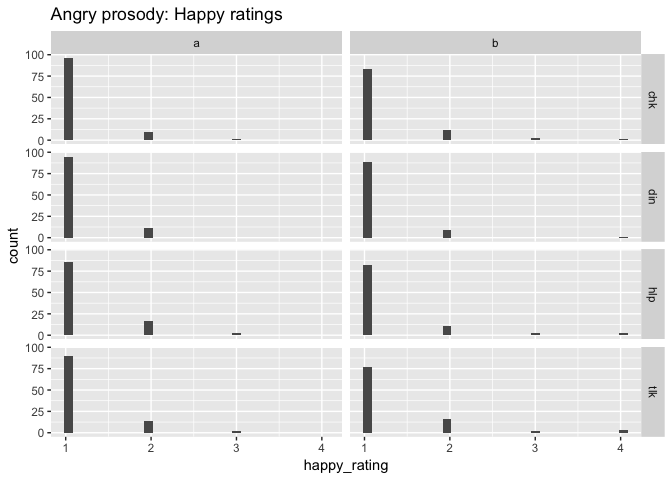
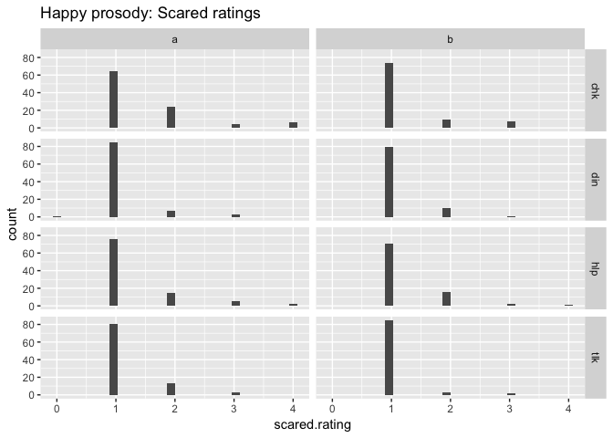
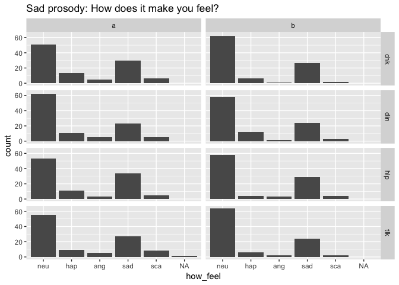

PEEP-II Behavioral Ratings
================
Rick Gilmore
2017-06-21 13:41:59

-   [Purpose](#purpose)
-   [Preliminaries](#preliminaries)
-   [Copy data and import](#copy-data-and-import)
-   [Mapping between ratings and image icons](#mapping-between-ratings-and-image-icons)
    -   [Angry ratings](#angry-ratings)
    -   [Happy ratings](#happy-ratings)
    -   [Sad ratings](#sad-ratings)
    -   [Scared ratings](#scared-ratings)
    -   [How feel ratings](#how-feel-ratings)
-   [Angry prosody](#angry-prosody)
    -   [Angry ratings](#angry-ratings-1)
    -   [Happy ratings](#happy-ratings-1)
    -   [Sad ratings](#sad-ratings-1)
    -   [Scared ratings](#scared-ratings-1)
    -   [How feel ratings](#how-feel-ratings-1)
-   [Happy prosody](#happy-prosody)
    -   [Happy ratings](#happy-ratings-2)
    -   [Angry ratings](#angry-ratings-2)
    -   [Sad ratings](#sad-ratings-2)
    -   [Scared ratings](#scared-ratings-2)
    -   [How feel ratings](#how-feel-ratings-2)
-   [Sad prosody](#sad-prosody)
    -   [Sad ratings](#sad-ratings-3)
    -   [Angry ratings](#angry-ratings-3)
    -   [Happy ratings](#happy-ratings-3)
    -   [How feel ratings](#how-feel-ratings-3)

Purpose
-------

This notebook documents the process of exploring the PEEP-II ratings data.

Preliminaries
-------------

Load libraries.

``` r
library(tidyverse)
```

    ## Loading tidyverse: ggplot2
    ## Loading tidyverse: tibble
    ## Loading tidyverse: tidyr
    ## Loading tidyverse: readr
    ## Loading tidyverse: purrr
    ## Loading tidyverse: dplyr

    ## Conflicts with tidy packages ----------------------------------------------

    ## filter(): dplyr, stats
    ## lag():    dplyr, stats

``` r
library(stringr)
```

Copy data and import
--------------------

The behavioral data are currently (2017-06-20-15:02) stored in `~/Box\ Sync/b-peep-project\ Shared/PEEP2\ data/PEEP2\ Home\ visit\ behavioural\ data/` as a set of `*.csv` files.

``` r
peep2.data.dir <- "~/Box\ Sync/b-peep-project\ Shared/PEEP2\ data/PEEP2\ Home\ visit\ behavioural\ data/"

# List files and open one for inspection
peep2.flist <- list.files(path = peep2.data.dir, pattern = "\\.csv$", full.names = TRUE)
peep2.test.df <- read.csv(file = peep2.flist[1])
str(peep2.test.df)
```

    ## 'data.frame':    33 obs. of  11 variables:
    ##  $ fam_id      : int  1 1 1 1 1 1 1 1 1 1 ...
    ##  $ nov_id      : int  6 6 6 6 6 6 6 6 6 6 ...
    ##  $ run         : int  1 1 1 1 1 1 1 1 1 1 ...
    ##  $ order       : int  4 4 4 4 4 4 4 4 4 4 ...
    ##  $ sound_index : int  1 2 3 4 5 6 7 8 9 10 ...
    ##  $ snd_file    : Factor w/ 32 levels "wav/001/norm/001-ang-chk-a.wav",..: 27 8 17 32 11 18 5 16 26 1 ...
    ##  $ happy_rating: int  2 4 1 1 1 1 1 1 1 1 ...
    ##  $ angry_rating: int  2 1 4 2 2 4 3 2 2 2 ...
    ##  $ sad_rating  : int  1 1 1 4 3 2 2 2 2 2 ...
    ##  $ how_feel    : int  1 1 1 1 1 2 2 3 1 1 ...
    ##  $ know_speaker: int  1 2 5 3 4 3 4 4 5 4 ...

It looks like the data files are well-structured and the variable names clear. **Note** that the ratings are on a \[1,4\] scale. I don't recall what the `know_speaker` ratings reflect now, but I will check.

Let's proceed to import the existing data and combine it into one file for visualization.

``` r
peep2.df.list <- lapply(peep2.flist, read.csv)
peep2.df <- Reduce(function(x,y) merge(x,y, all =TRUE), peep2.df.list)
str(peep2.df)
```

    ## 'data.frame':    2236 obs. of  12 variables:
    ##  $ fam_id       : int  1 1 1 1 1 1 1 1 1 1 ...
    ##  $ nov_id       : int  6 6 6 6 6 6 6 6 6 6 ...
    ##  $ run          : int  1 1 1 1 1 1 1 1 1 1 ...
    ##  $ order        : int  4 4 4 4 4 4 4 4 4 4 ...
    ##  $ sound_index  : int  1 2 3 4 5 6 7 8 9 10 ...
    ##  $ snd_file     : Factor w/ 1248 levels "wav/001/norm/001-ang-chk-a.wav",..: 27 8 17 32 11 18 5 16 26 1 ...
    ##  $ happy_rating : int  2 4 1 1 1 1 1 1 1 1 ...
    ##  $ angry_rating : int  2 1 4 2 2 4 3 2 2 2 ...
    ##  $ sad_rating   : int  1 1 1 4 3 2 2 2 2 2 ...
    ##  $ how_feel     : int  1 1 1 1 1 2 2 3 1 1 ...
    ##  $ know_speaker : int  1 2 5 3 4 3 4 4 5 4 ...
    ##  $ scared.rating: int  NA NA NA NA NA NA NA NA NA NA ...

It looks like the `scared.rating` occurs in some of the later data files, but was not present in the first one we examined. Note that that we do not have a variable that specifies the target prosody {'ang', 'hap', 'neu', 'sad'}, the script type {'chk', ...}, or the script variation {'a', 'b'}, but that these are available from the `snd_file` name. It should be relatively easy to pull those from the `snd_file` names. Let's see.

``` r
# Pick character ranges by hand
peep2.df$target_prosody <- str_sub(peep2.df$snd_file, 18, 20)
peep2.df$script_name <- str_sub(peep2.df$snd_file, 22, 24)
peep2.df$script_variation <- str_sub(peep2.df$snd_file, 26, 26)
```

Mapping between ratings and image icons
---------------------------------------

### Angry ratings

|                    1                   |                    2                    |                    3                    |                    4                    |     |
|:--------------------------------------:|:---------------------------------------:|:---------------------------------------:|:---------------------------------------:|:---:|
|  |  |  |  |     |

### Happy ratings

|                    1                   |                    2                    |                    3                    |                    4                    |     |
|:--------------------------------------:|:---------------------------------------:|:---------------------------------------:|:---------------------------------------:|:---:|
|  |  |  |  |     |

### Sad ratings

|                    1                   |                    2                    |                    3                    |                    4                    |     |
|:--------------------------------------:|:---------------------------------------:|:---------------------------------------:|:---------------------------------------:|:---:|
|  |  |  |  |     |

### Scared ratings

|                    1                   |                    2                    |                    3                    |                    4                    |     |
|:--------------------------------------:|:---------------------------------------:|:---------------------------------------:|:---------------------------------------:|:---:|
|  |  |  |  |

### How feel ratings

|                 Neutral                |                  Happy                  |                  Angry                  |                   Sad                   |                  Scared                 |
|:--------------------------------------:|:---------------------------------------:|:---------------------------------------:|:---------------------------------------:|:---------------------------------------:|
|  |  |  |  |  |
|                    1                   |                    2                    |                    3                    |                    4                    |                    5                    |

Angry prosody
-------------

### Angry ratings

``` r
peep2.df %>%
  filter(target_prosody %in% "ang") %>%
  ggplot() +
  aes(x = script_name, y = angry_rating) + 
  geom_violin() +
  facet_grid(. ~ script_variation) +
  ggtitle("Angry prosody: Anger ratings")
```


[Angry ratings legend](ratings-facial-exemplars.md)

### Happy ratings

``` r
peep2.df %>%
  filter(target_prosody %in% "ang") %>%
  ggplot() +
  aes(x = script_name, y = happy_rating) + 
  geom_violin() +
  facet_grid(. ~ script_variation) +
  ggtitle("Angry prosody: Happy ratings")
```



### Sad ratings

``` r
peep2.df %>%
  filter(target_prosody %in% "ang") %>%
  ggplot() +
  aes(x = script_name, y = sad_rating) + 
  geom_violin() +
  facet_grid(. ~ script_variation) +
  ggtitle("Angry prosody: Sad ratings")
```


### Scared ratings

``` r
peep2.df %>%
  filter(target_prosody %in% "ang") %>%
  ggplot() +
  aes(x = script_name, y = scared.rating) + 
  geom_violin() +
  facet_grid(. ~ script_variation) +
  ggtitle("Angry prosody: Scared ratings")
```

    ## Warning: Removed 64 rows containing non-finite values (stat_ydensity).


### How feel ratings

The `how_feel` variable codes on a \[1,5\] scale the participant's response to the question: 'How did this make you feel?'

The mapping from facial expression to image exemplar was as follows: 1 = neutral, 2 = mid-happy, 3 = mid-angry, 4= mid-sad, 5 = mid-scared.

``` r
peep2.df %>%
  filter(target_prosody %in% "ang") %>%
  ggplot() +
  aes(x = script_name, y = how_feel) + 
  geom_violin() +
  facet_grid(. ~ script_variation) +
  ggtitle("Angry prosody: How does it make you feel?")
```


Happy prosody
-------------

### Happy ratings

``` r
peep2.df %>%
  filter(target_prosody %in% "hap") %>%
  ggplot() +
  aes(x = script_name, y = happy_rating) + 
  geom_violin() +
  facet_grid(. ~ script_variation) +
  ggtitle("Happy prosody: Happy ratings")
```


### Angry ratings

``` r
peep2.df %>%
  filter(target_prosody %in% "hap") %>%
  ggplot() +
  aes(x = script_name, y = angry_rating) + 
  geom_violin() +
  facet_grid(. ~ script_variation) +
  ggtitle("Happy prosody: Angry ratings")
```


### Sad ratings

``` r
peep2.df %>%
  filter(target_prosody %in% "hap") %>%
  ggplot() +
  aes(x = script_name, y = sad_rating) + 
  geom_violin() +
  facet_grid(. ~ script_variation) +
  ggtitle("Happy prosody: Sad ratings")
```


### Scared ratings

``` r
peep2.df %>%
  filter(target_prosody %in% "hap") %>%
  ggplot() +
  aes(x = script_name, y = scared.rating) + 
  geom_violin() +
  facet_grid(. ~ script_variation) +
  ggtitle("Happy prosody: Scared ratings")
```

    ## Warning: Removed 64 rows containing non-finite values (stat_ydensity).



### How feel ratings

``` r
peep2.df %>%
  filter(target_prosody %in% "hap") %>%
  ggplot() +
  aes(x = script_name, y = how_feel) + 
  geom_violin() +
  facet_grid(. ~ script_variation) +
  ggtitle("Happy prosody: How does it make you feel?")
```


Sad prosody
-----------

### Sad ratings

``` r
peep2.df %>%
  filter(target_prosody %in% "sad") %>%
  ggplot() +
  aes(x = script_name, y = sad_rating) + 
  geom_violin() +
  facet_grid(. ~ script_variation) +
  ggtitle("Sad prosody: Sad ratings")
```


### Angry ratings

``` r
peep2.df %>%
  filter(target_prosody %in% "sad") %>%
  ggplot() +
  aes(x = script_name, y = angry_rating) + 
  geom_violin() +
  facet_grid(. ~ script_variation) +
  ggtitle("Sad prosody: Angry ratings")
```


### Happy ratings

``` r
peep2.df %>%
  filter(target_prosody %in% "sad") %>%
  ggplot() +
  aes(x = script_name, y = happy_rating) + 
  geom_violin() +
  facet_grid(. ~ script_variation) +
  ggtitle("Sad prosody: Happy ratings")
```


### How feel ratings

``` r
peep2.df %>%
  filter(target_prosody %in% "sad") %>%
  ggplot() +
  aes(x = script_name, y = how_feel) + 
  geom_violin() +
  facet_grid(. ~ script_variation) +
  ggtitle("Sad prosody: How does it make you feel?")
```


