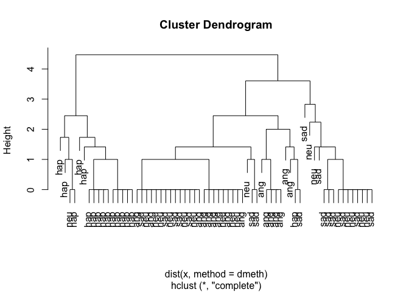
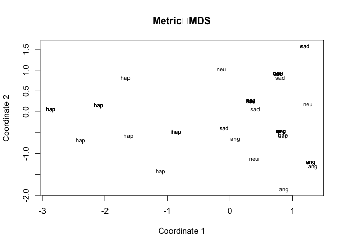
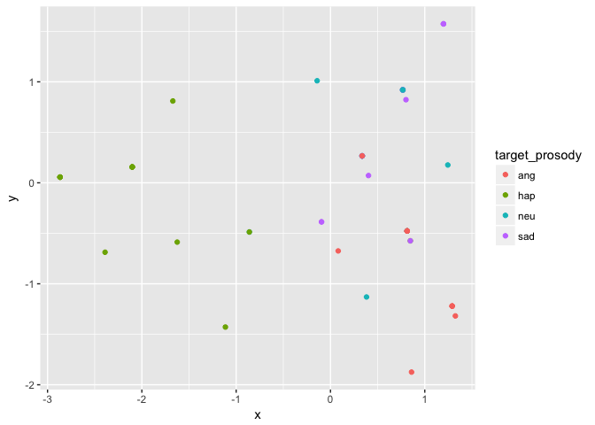
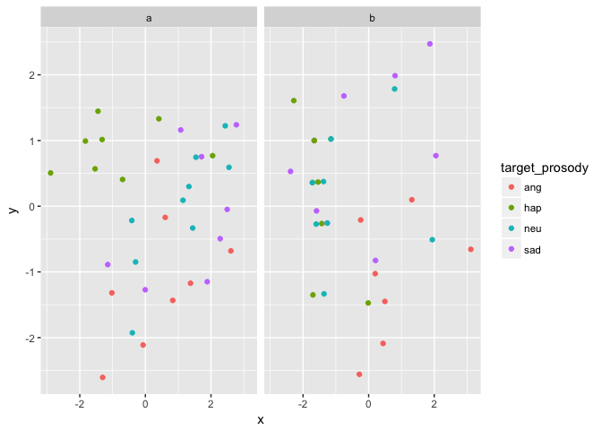
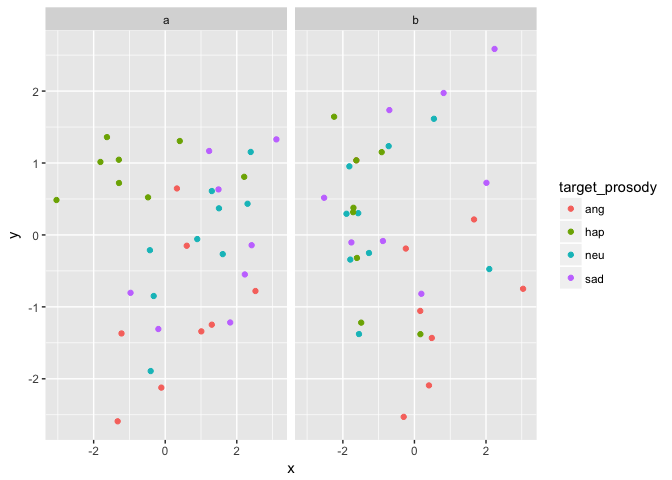

cluster-analysis
================
Rick Gilmore
2017-07-11 10:09:21

-   [Purpose](#purpose)
-   [Copy data and import](#copy-data-and-import)
-   [Hierarchical clustering](#hierarchical-clustering)
-   [Multidimensional scaling](#multidimensional-scaling)
-   [K-means](#k-means)

Purpose
-------

This notebook documents the process of evaluating the clusters within the PEEP-II (or peep2) ratings data.

``` r
library(tidyverse)
```

    ## Loading tidyverse: ggplot2
    ## Loading tidyverse: tibble
    ## Loading tidyverse: tidyr
    ## Loading tidyverse: readr
    ## Loading tidyverse: purrr
    ## Loading tidyverse: dplyr

    ## Conflicts with tidy packages ----------------------------------------------

    ## filter(): dplyr, stats
    ## lag():    dplyr, stats

``` r
library(stringr)
```

Copy data and import
--------------------

The behavioral data are currently (2017-06-20-15:02) stored in `~/Box\ Sync/b-peep-project\ Shared/PEEP2\ data/PEEP2\ Home\ visit\ behavioural\ data/` as a set of `*.csv` files.

``` r
peep2.data.dir <- "~/Box\ Sync/b-peep-project\ Shared/PEEP2\ data/PEEP2\ Home\ visit\ behavioural\ data/"

# List files and open one for inspection
peep2.flist <- list.files(path = peep2.data.dir, pattern = "\\.csv$", full.names = TRUE)
peep2.test.df <- read.csv(file = peep2.flist[1])
peep2.df.list <- lapply(peep2.flist, read.csv)
peep2.df <- Reduce(function(x,y) merge(x,y, all =TRUE), peep2.df.list)

# Pick character ranges by hand
peep2.df$target_prosody <- str_sub(peep2.df$snd_file, 18, 20)
peep2.df$script_name <- str_sub(peep2.df$snd_file, 22, 24)
peep2.df$script_variation <- str_sub(peep2.df$snd_file, 26, 26)

# Trim sound file names for easier viewing
peep2.df$snd_file <- str_sub(peep2.df$snd_file, 14, 26)
```

Hierarchical clustering
-----------------------

There are too many exemplars to do a full cluster analysis with `hclust()`, so I have to choose a subset. Perhaps we should look at the clusters on a participant-by-participant basis.

Let's create a function to create a cluster fit from the raw score data see <https://stackoverflow.com/questions/20343398/how-to-use-hclust-as-function-call-in-r>.

``` r
hclustfunc <- function(x, method = "complete", dmeth = "euclidean") {    
    hclust(dist(x, method = dmeth), method = method)
}
```

``` r
this_fam = 1
peep2.df %>%
  filter(fam_id == this_fam) -> this_fam.df

this_fam.df %>%
  select(sad_rating, happy_rating, angry_rating, how_feel) %>%
  hclustfunc() -> fit

plot(fit, labels = this_fam.df$target_prosody)
```



Multidimensional scaling
------------------------

``` r
# select ratings
d <-dist(this_fam.df[,7:10])
mds_fit <- cmdscale(d, eig=TRUE, k=2)

x <- mds_fit$points[,1]
y <- mds_fit$points[,2]
plot(x, y, xlab="Coordinate 1", ylab="Coordinate 2",  main="Metric  MDS",   type="n")
text(x, y, labels = this_fam.df[,'target_prosody'], cex=.7)
```



Let's try a ggplot version.

``` r
# Make new data frame
mds.df <- data.frame(x = mds_fit$points[,1],
                     y = mds_fit$points[,2],
                     target_prosody = this_fam.df$target_prosody,
                     script_name <- this_fam.df$script_name,
    script_variation = this_fam.df$script_variation)

mds.df %>%
  ggplot() +
  aes(x = x, y = y, color = target_prosody) +
  geom_point()
```



``` r
# Try with another family
this_fam = 2
peep2.df %>%
  filter(fam_id == this_fam) -> this_fam.df
# select ratings (not scared)
d <- dist(this_fam.df[,7:10])
mds_fit <- cmdscale(d, eig=TRUE, k=2)
mds.df <- data.frame(x = mds_fit$points[,1],
                     y = mds_fit$points[,2],
                     target_prosody = this_fam.df$target_prosody,
                     script_name <- this_fam.df$script_name,
    script_variation = this_fam.df$script_variation)

mds.df %>%
  ggplot() +
  aes(x = x, y = y, color = target_prosody) +
  geom_point() +
  facet_grid(. ~ script_variation)
```



Let's try a version for this subject adding back in the `scared.rating`.

``` r
this_fam = 2
peep2.df %>%
  filter(fam_id == this_fam) -> this_fam.df

d <- dist(this_fam.df[,c('happy_rating',
                         'angry_rating',
                         'sad_rating',
                         'how_feel',
                         'scared.rating')])
mds_fit <- cmdscale(d, eig=TRUE, k=2)
mds.df <- data.frame(x = mds_fit$points[,1],
                     y = mds_fit$points[,2],
                     target_prosody = this_fam.df$target_prosody,
                     script_name <- this_fam.df$script_name,
    script_variation = this_fam.df$script_variation)

mds.df %>%
  ggplot() +
  aes(x = x, y = y, color = target_prosody) +
  geom_point() +
  facet_grid(. ~ script_variation)
```



K-means
-------

``` r
this_fam = 2
peep2.df %>%
  filter(fam_id == this_fam) -> this_fam.df

ratings <- this_fam.df[,c('happy_rating',
                         'angry_rating',
                         'sad_rating',
                         'how_feel',
                         'scared.rating')]

set.seed(20)
ratings_cluster <- kmeans(this_fam.df[,c('happy_rating',
                         'angry_rating',
                         'sad_rating',
                         'how_feel',
                         'scared.rating')], 
                         centers = 4, 
                         nstart = 20)
ratings_cluster
```

    ## K-means clustering with 4 clusters of sizes 15, 18, 11, 22
    ## 
    ## Cluster means:
    ##   happy_rating angry_rating sad_rating how_feel scared.rating
    ## 1     1.800000     3.200000   2.800000 4.333333      2.066667
    ## 2     1.444444     2.944444   2.500000 1.611111      2.166667
    ## 3     1.636364     1.363636   3.909091 3.909091      2.454545
    ## 4     3.409091     1.863636   1.863636 1.863636      1.772727
    ## 
    ## Clustering vector:
    ##  [1] 1 4 1 2 2 2 4 3 2 2 1 3 4 1 1 3 3 1 3 2 1 4 3 1 4 3 2 3 2 4 2 1 1 2 2
    ## [36] 2 4 1 4 1 4 3 1 3 4 4 2 4 4 2 1 4 4 1 2 4 2 4 4 2 3 4 4 2 4 4
    ## 
    ## Within cluster sum of squares by cluster:
    ## [1] 49.46667 54.66667 33.63636 60.95455
    ##  (between_SS / total_SS =  51.3 %)
    ## 
    ## Available components:
    ## 
    ## [1] "cluster"      "centers"      "totss"        "withinss"    
    ## [5] "tot.withinss" "betweenss"    "size"         "iter"        
    ## [9] "ifault"

``` r
table(ratings_cluster$cluster, this_fam.df$target_prosody)
```

    ##    
    ##     ang hap neu sad
    ##   1   6   1   4   4
    ##   2   8   2   4   4
    ##   3   1   1   4   5
    ##   4   1  12   6   3

``` r
# this_fam.df %>% 
#   ggplot() +
#   aes(happy_rating, how_feel, color = as.factor(ratings_cluster$cluster)) + 
#   geom_point()
```
