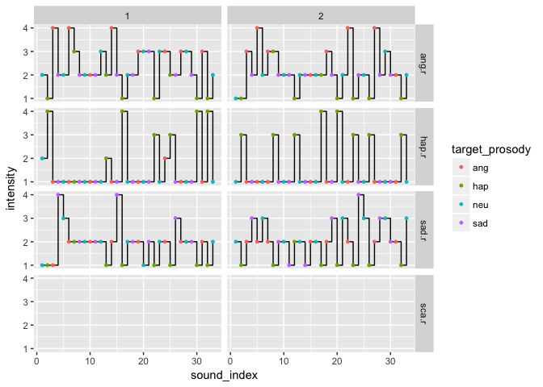
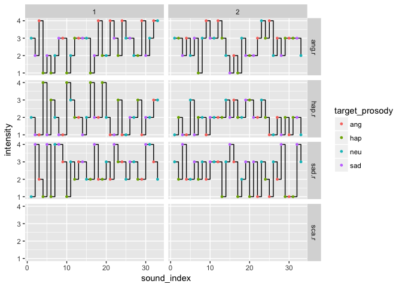
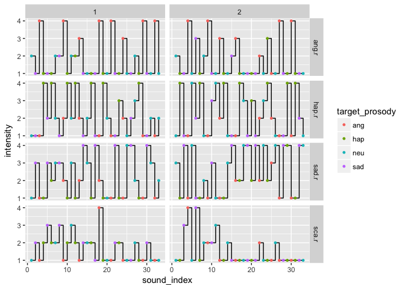

```{r setup, include=FALSE}
knitr::opts_chunk$set(echo = FALSE)
```

# Time series

## Participant 1

<div class="centered">

</div>

## Participant 3

<div class="centered">

</div>

## Participant 5

<div class="centered">

</div>
