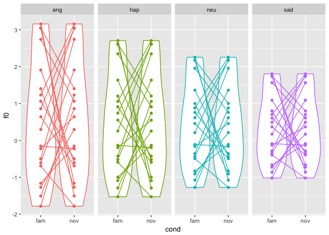
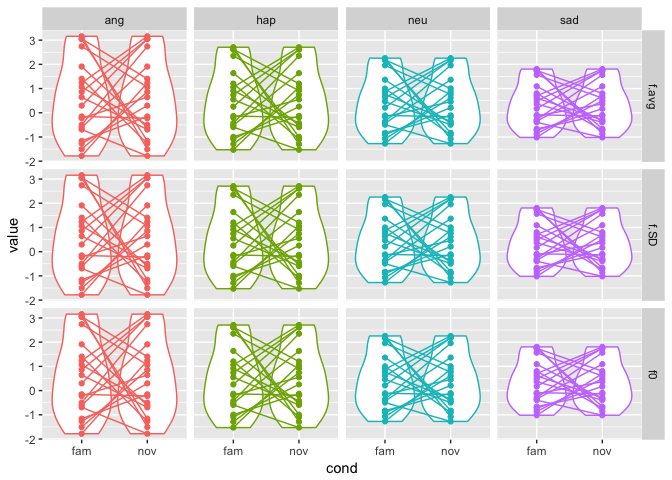

Plotting PEEP-II Acoustics
================
Rick O. Gilmore
2018-03-28 03:00:37

-   [Purpose](#purpose)
-   [1st try](#st-try)

This is an [R Markdown](http://rmarkdown.rstudio.com) Notebook. When you execute code within the notebook, the results appear beneath the code.

Purpose
-------

How do we plot PEEP-II acoustic parameters to show the differences between familiar and novel speakers and the different prosody conditions?

``` r
library(tidyverse)
```

1st try
-------

It's helpful to see all of the individual familiar/novel comparisons. Let's try that as a first pass. We'll pretend we're analyzing the f0 acoustic parameter. There are 20 participant dyads, each of which served as its own "familiar" set and another dyad's "novel" set. For the time being, let's ignore the fact that there were four prosodies and multiple exemplars (scripts & variations) within each prosody.

Here's a "tidy" data structure for these variables:

| id   | f0  | cond           | prosody                      |
|------|-----|----------------|------------------------------|
| 1..n | ?   | {'fam', 'nov'} | {'ang', 'hap', 'sad', 'neu'} |

So, each of the 1..n id's has at least two rows: One with with the familiar 'fam' (self) data, and a second row with the novel 'nov' f0 data. An even more general data structure would be as follows:

| id   | measure               | value | cond           | prosody                      |
|------|-----------------------|-------|----------------|------------------------------|
| 1..n | {'f0', 'f\_var', ...} | ?     | {'fam', 'nov'} | {'ang', 'hap', 'sad', 'neu'} |

But we'll come back to that. Let's deal with the simpler case.

I'm going to make the prosody effects big so we can see them. Let's say that the sad prosody is the baseline. Neutral prosodies are 1.25 times the sad; happy prosodies are 1.5 times; and angry prosodies are 1.75 times sad. I'm going to assume that there is *no* effect of familiar versus We'll also assume that every participant is the novel comparison for another. I'm going to do this in a less efficient, but more transparent way.

``` r
# Index for choosing novel comparison
n.prosodies <- 4
fam.ids <- 1:n.participants
nov.ids <- sample(fam.ids, n.participants, replace = FALSE)
n.conds.per.id <- 2

measure.values.sad.fam <- rnorm(n.participants)
measure.values.neu.fam <- measure.values.sad.fam * neu.factor
measure.values.hap.fam <- measure.values.sad.fam * hap.factor
measure.values.ang.fam <- measure.values.sad.fam * ang.factor

measure.values.sad.nov <- measure.values.sad.fam[nov.ids]
measure.values.neu.nov <- measure.values.neu.fam[nov.ids]
measure.values.hap.nov <- measure.values.hap.fam[nov.ids]
measure.values.ang.nov <- measure.values.ang.fam[nov.ids]

f0.df <- data.frame(id = rep(rep(fam.ids, n.prosodies), n.conds.per.id), 
                    f0 = c(measure.values.sad.fam,
                           measure.values.neu.fam,
                           measure.values.hap.fam,
                           measure.values.ang.fam,
                           measure.values.sad.nov,
                           measure.values.neu.nov,
                           measure.values.hap.nov,
                           measure.values.ang.nov), 
                    cond = rep(c('fam', 'nov'), each = n.participants*n.prosodies),
                    prosody = rep(rep(c('sad', 'neu', 
                                        'hap', 'ang'),
                                      each=n.participants), 2))
```

Ok, let's plot this. I'm going to put each prosody in a separate column.

``` r
f0.df %>%
  ggplot(.) +
  aes(., x = cond, y = f0, color = prosody) +
  geom_violin() +
  geom_point() +
  geom_line(aes(group = id)) +
  facet_grid(. ~ prosody) +
  theme(legend.position = "none")
```



This shows the effect of the prosody manipulation, and the pairwise differences between the familiar/novel pairings. But it also shows that there are no systematic differences in the familiar novel contrast overall.

To see what this might look like for a *set* of acoustic measures, we just do this. I don't have handy the acoustic measure names, so I just made them up.

``` r
n.measures <- 3
acoustic.df <- data.frame(id = rep(rep(rep(fam.ids, n.prosodies),
                                       n.conds.per.id), n.measures),
                          measure = rep(c("f0", "f.avg", "f.SD"), each = n.participants * n.prosodies * n.conds.per.id),
                          value = rep(c(measure.values.sad.fam,
                                     measure.values.neu.fam,
                                     measure.values.hap.fam,
                                     measure.values.ang.fam,
                                     measure.values.sad.nov,
                                     measure.values.neu.nov,
                                     measure.values.hap.nov,
                                     measure.values.ang.nov), n.measures), 
                          cond = rep(rep(c('fam', 'nov'), each = n.participants*n.prosodies), n.measures),
                          prosody = rep(rep(c('sad', 'neu', 
                                              'hap', 'ang'),
                                            each=n.participants), 2), n.measures)
```

And here is the plot, now with `measure` in the rows.

``` r
acoustic.df %>%
  ggplot(.) +
  aes(., x = cond, y = value, color = prosody, group = id) +
  geom_violin(aes(group = cond)) +
  geom_point() +
  geom_line() +
  facet_grid(measure ~ prosody) +
  theme(legend.position = "none")
```



This probably isn't quite right since the different acoustic measures have different scales and units.
